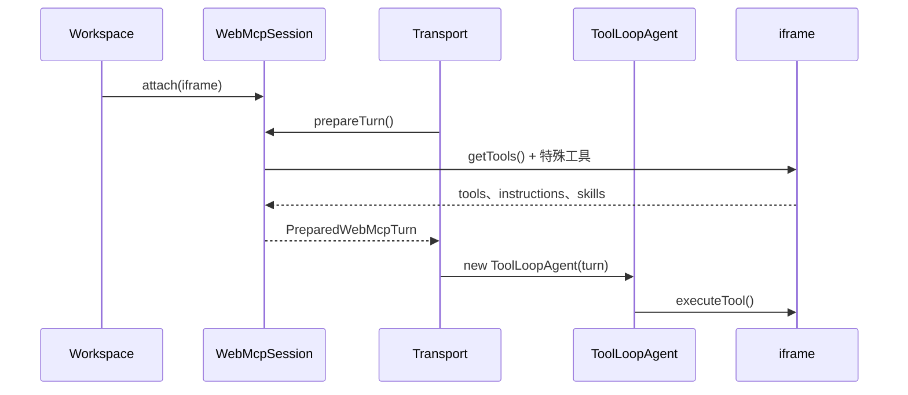
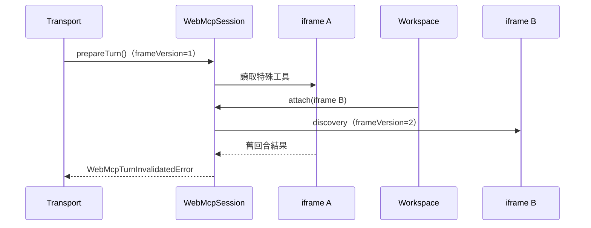

# 關鍵序列

## 正常送出訊息

```mermaid
sequenceDiagram
  participant W as Workspace
  participant S as WebMcpSession
  participant T as Transport
  participant A as ToolLoopAgent
  participant F as iframe

  W->>S: attach(iframe)
  T->>S: prepareTurn()
  S->>F: getTools() + 特殊工具
  F-->>S: tools、instructions、skills
  S-->>T: PreparedWebMcpTurn
  T->>A: new ToolLoopAgent(turn)
  A->>F: executeTool()
```

## 切換網站時的競態

```mermaid
sequenceDiagram
  participant T as Transport
  participant S as WebMcpSession
  participant A as iframe A
  participant W as Workspace
  participant B as iframe B

  T->>S: prepareTurn()（frameVersion=1）
  S->>A: 讀取特殊工具
  W->>S: attach(iframe B)
  S->>B: discovery（frameVersion=2）
  A-->>S: 舊回合結果
  S-->>T: WebMcpTurnInvalidatedError
```
