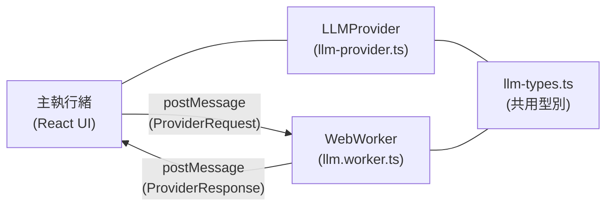

# WebWorker LLM Provider 實作完成

## 變更摘要

依照 `PLAN_TFS.md` 完成兩層架構實作：

### 新增檔案

| 檔案 | 職責 |
|------|------|
| [llm-types.ts](file:///c:/projects/webmcp-agent/src/lib/llm-types.ts) | 通訊型別定義（Request/Response/Payload 等） |
| [llm.worker.ts](file:///c:/projects/webmcp-agent/src/workers/llm.worker.ts) | WebWorker 層：Transformers.js 載入與呼叫 |
| [llm-provider.ts](file:///c:/projects/webmcp-agent/src/lib/llm-provider.ts) | 管理層：與 WebWorker 溝通的 Promise-based API |

---

## 架構設計

### 第 1 層：WebWorker (`llm.worker.ts`)

1. **模型管理**：使用 `AutoProcessor` + `Gemma4ForConditionalGeneration` 載入 Gemma 4 系列模型
2. **進度回報**：透過 `progress_callback` 監聽下載進度，回傳 `PROGRESS` 狀態
3. **標準生成**：`model.generate` + `batch_decode` + Prompt 裁切（`outputs.slice`）
4. **串流生成**：`TextStreamer` + `callback_function` 逐 Token 回傳 `STREAMING` 狀態
5. **多模態**：解析 `ChatMessage[]` 中的 `image` / `audio` 來源，傳入 `processor(prompt, ...media)`
6. **Chat Template**：支援 `enable_thinking`、`tools` 參數注入
7. **錯誤處理**：OOM / WebGPU context loss / Template 失敗，皆以 `Status + Root Cause + Suggested Fix` 格式回報

### 第 2 層：管理層 (`llm-provider.ts`)

1. **Promise 封裝**：每個請求分配 `ulid` 作為 ID，追蹤 pending Map
2. **中間狀態回呼**：`PROGRESS` / `STREAMING` 不結算 Promise，透過回呼函式即時傳遞
3. **公開 API**：
   - `listModels()` — 取得可用模型清單
   - `loadModel(payload, onProgress)` — 載入模型，支援進度回呼
   - `generate(messages, options)` — 標準生成
   - `generateStream(messages, onStream, options)` — 串流生成
   - `abort()` — 中止當前生成
   - `dispose()` — 銷毀 Worker 並清理資源
4. **Singleton**：`getLLMProvider()` / `disposeLLMProvider()` 全域單例管理
5. **Worker 錯誤處理**：未捕獲錯誤自動拒絕所有 pending 請求

---

## 驗證結果

- TypeScript 編譯通過（新檔案無型別錯誤）
- 剩餘 6 個 `TS6133` 錯誤為既有程式碼的 unused variable，與本次變更無關
